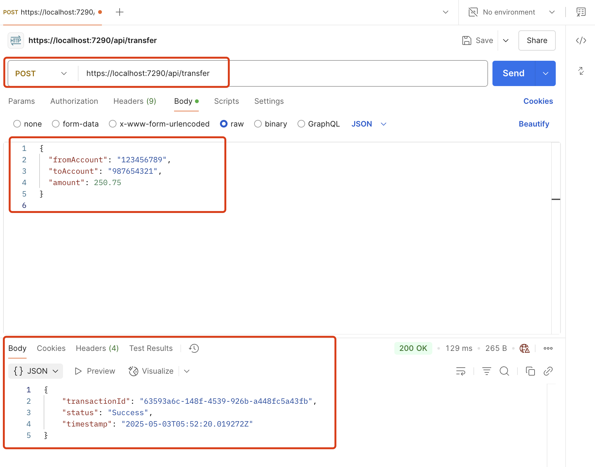

# 💸 Simple Bank Payments API

A mock .NET 6 Web API for simulating bank transfers. 
I built a simple RESTful Web API in ASP.NET Core to simulate banking transactions. 
It includes transfer logic, validation, structured logging, global error handling, Swagger for testing, and containerisation with Docker. I used this project to strengthen my backend fundamentals and understand how to build reliable APIs., and integrated with GitHub Actions for CI.


---

## Features

- ✅ POST API endpoint to simulate bank transfers
- ✅ Validates sender, receiver, and amount fields
- ✅ Generates unique transaction ID and timestamp
- ✅ Swagger UI
- ✅ Integrated logging with `ILogger<T>` to track request activity
- ✅ Global error handling using `UseExceptionHandler()` middleware with standard JSON response
- ✅ Containerised with Docker
- ✅ CI pipeline with GitHub Actions

---

## Tech Stack

- ASP.NET Core 6 Web API
- C#
- Docker
- GitHub Actions
- Postman (for manual testing)

---

## Sample Request

**POST** `/api/transfer`
This endpoint simulates a successful bank transfer.

```json
{
  "fromAccount": "123456789",
  "toAccount": "987654321",
  "amount": 250.75
}
```

## Sample Response

```json
{
  "transactionId": "a8a4d483-c3a6-46b3-922f-bb52cdfdc863",
  "status": "Success",
  "timestamp": "2025-05-03T05:20:37.0781199Z"
}
```

## Postman Response Screenshot


 
## Logging Output Example
The log includes timestamp, source and target accounts, and transfer amount – useful for debugging and auditing.


## Error Handling Example
Implement global exception handling using UseExceptionHandler middleware

- Captures unhandled exceptions across the app
- Logs error details using ILogger<Program>
- Returns consistent JSON error response with HTTP 500


## Swagger UI Test Example

1. Run the application:
```bash
dotnet run
```
2. Open your browser and navigate to:
http://localhost:<your-port>/swagger


## Run Locally

```bash
dotnet run
```

Access via:
https://localhost:<your-port>/api/transfer

## Run with Docker

docker build -t simple-bank-api .
docker run -d -p 8080:80 simple-bank-api

Then POST to:
http://localhost:8080/api/transfer

## Project Structure

```bash

SimpleBankPaymentsAPI
├── Controllers
│   └── TransferController.cs
├── Models
│   └── TransferRequest.cs
├── Program.cs
├── Dockerfile
├── README.md
└── .github
    └── workflows
        └── dotnet.yml
```
